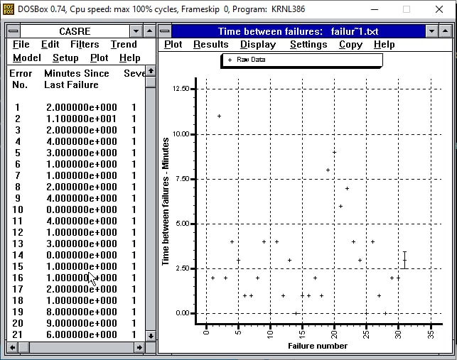
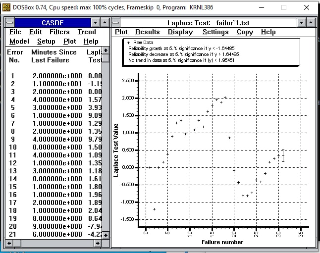
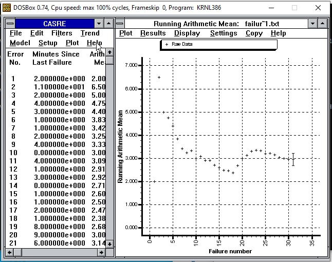
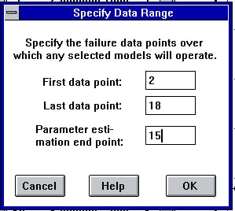
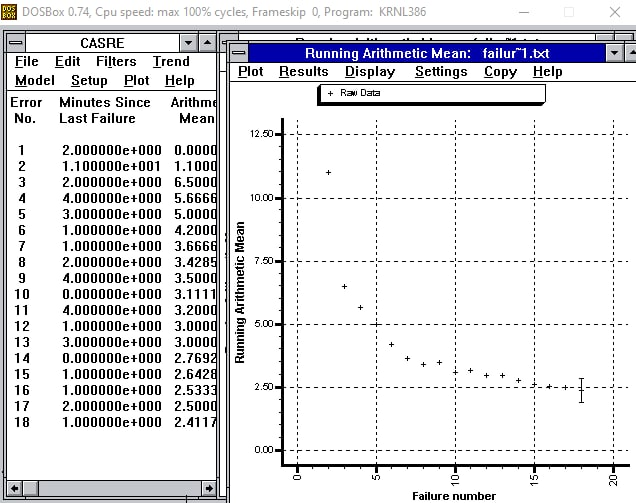
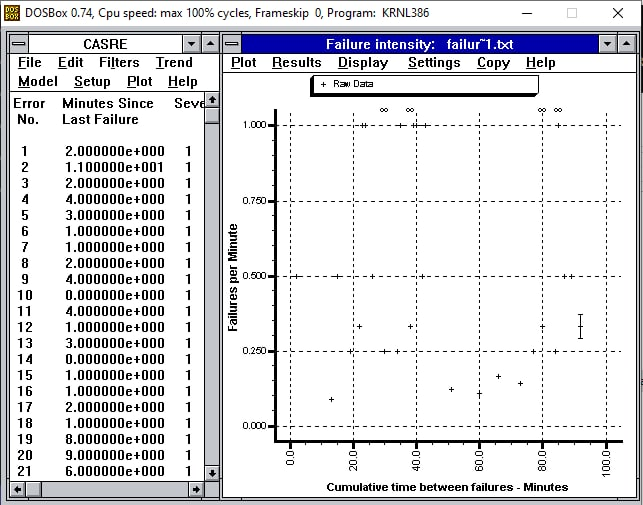
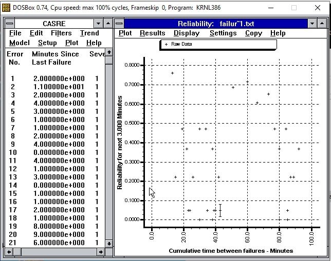
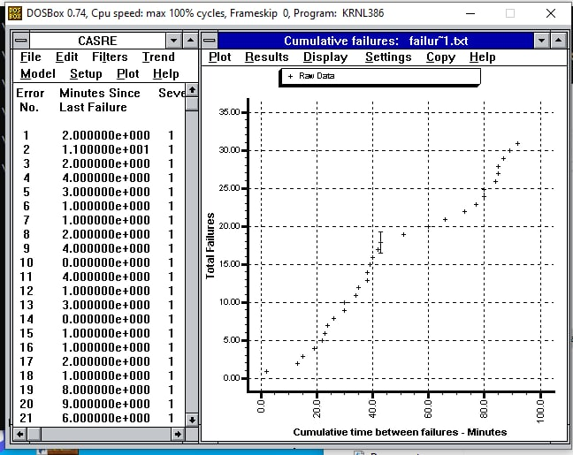

****SENG 637 - Dependability and Reliability of Software Systems****

**Lab. Report \#5 – Software Reliability Assessment**

| Group \#:              | 16  |
|------------------------|-----|
| Shahryar Soltanpour    |     |
| Mohammad Reza Kianifar |     |
| Muhammad Raihan        |     |

(Note that some labs require individual reports while others require one report
for each group. Please see each lab document for details.)

# Link of demo video

[Video Link](TODO://add-here-the-link-of-the-video)

It works for everyone with logged-in university account on outlook. Please [tell us](mailto:mohammadreza.kianifa@ucalgary.ca) if you had any problem.

# Introduction
In the first phase of this assignment, we wanted to assess the reliability of a system. We are given the time between 
the failures' data, and we must run the reliability assessment on it. There are 31 records in the dataset. 
The first column is the time interval, the second column is failure count, the third column is the execution time 
measured in hours, the fourth column is the failure identification work measured in person hours and the last column is
computer time failure identification measured in hours.
For analyzing this system, we used three tools:

1. SRTAT
2. C-SFRAT
3. CASRE

The first one which is a tool that is developed in Dr. Far's laboratory, wasn't complete, and after preparing the data,
we couldn't get a diagram as an output from it. So we decided to use C-SFRAT. This tool worked better but it didn't have
all the features we wanted such as Laplace. So we switched to the third tool which was in the artifact directory: C-SFRAT.

For the second part of the assignment, we use Reliability Demonstration Chart (RDC) excel sheet to plot the failure 
number versus the number of input events in normalized usage events. This tool helps us understand whether the target 
failure rate or Mean Time to Failure (MTTF) is met or not.

After completing these two phases, we compare the result.

# Assessment Using Reliability Growth Testing 
First, we tried to use the SRTAT tool which has been developed in Dr. Far's laboratory. After converting the input and 
importing that to the software, there were some logical problems that we received errors and the diagram couldn't be 
displayed. 

So we switched to C-SFRAT software. We imported the data and the diagram looked like this:

We tried different models to fit the data and 2 of them worked well:
1. Geometric Fit for E, F, and C parameters:

2. Truncated Logistic for E, and F parameters:

But we couldn't continue the rest of the project with this tool because it didn't support features like Laplace or 
reliability graphs. So we again switched to use a new tool: CASRE which is a tool that is developed by NASA.

First we had to change the data format again to import that to the CASRE. For that, we had to remove the 4th and 5th 
columns. After that, the imported data was like this:

Then we ran 2 tests on the data. The first one was Laplace. The Laplace test is a trend test. Trend tests is used to
help determine whether the system undergoes reliability growth, decrease, or stable reliability. In the Laplace testing,
positive values of the Laplace factor u(i) indicate an increasing failure intensity and negative values indicate a
decreasing failure intensity, and the values between –2 and +2 indicate stable reliability. However, none of the data
points were lower than -2, and the graphs of them did not give us useful information about the data points
because a few of them are above 2 and most of them are between -2 to 2, so we decided to use the other trend test
approach too to choose the useful range, Arithmetic Average of Time Between Failures.

As you can see in the next figure, the result is in much better shape than Laplace Test. From the Range 2 to 18, we have
a decreasing failure count so that's the range which we want to use.

In the next 2 figures, you can see the selected range using the Arithmetic Mean Test.

You can see the Time between failures in the first figure that CASRE is used. In the next 3 figures, you can see the 
failure intensity, reliability graphs, and total failures.

### The advantages and disadvantages of reliability growth analysis

Advantages
* We could predict future reliability, failure intensity, and time between the failures with this analysis.
* With this method, we could decide if the testing of the system is enough by measuring the reliability.
* With this approach, we could find out if the system has reached the reliability that the customer or manager wants or not.
* Decisions related to reliability growth are: tracking bugs in pre-release, guiding the software testing process, and releasing the product.

Disadvantages
* The result of it is not that reliable with a small dataset.
* It was challenging to work with the tools because most of them only run in Windows OS systems.
* Since this approach needs more data points compared to the Reliability Demonstration Chart, it might be more time-consuming to collect the data.

# Assessment Using Reliability Demonstration Chart 

# Comparison of Results
* At the end of the data range, the time between failures is increasing which means the reliability increases. But in RDC, based on MTTF value the cumulative data region signifies the reliability factor, i.e the SUT is acceptable/reject/continue.
* Also, we could predict the reliability of the system for the next future minutes, which is not possible in the RDC method.
* Since the dataset is small, RDC is more reliable in comparison with the reliability growth analysis.
* The RDC technique is like a classification problem, which decides whether this software is reliable or not, accepts or rejects the current system, or needs more data to decide. But reliability growth testing is somehow like a regression problem that predicts the future reliability, failure rate, and time between the failures.
* With the reliability growth analysis, we found out that the current failure rate is about 2.9 failures per minute, which is not acceptable if we consider the target failure rate’s value as 0.01. We could predict when we will reach this target if the current pattern continues. On the other hand, RDC itself does this calculation based on the risk inputs (Developer's Risk α and Users risk β) that we give them to the system.

# Discussion on Similarity and Differences of the Two Techniques
* The RDC technique is like a classification problem, which decides whether this software is reliable or not, accepts or rejects the current system, or if it needs more data to decide, but reliability growth testing is like a regression problem that predicts the future reliability.
* Reliability growth testing is for assessing the current reliability, identifying and eliminating the faults, and predicting future reliability. On the other hand, Reliability Demonstration Chart is used toward the end of the growth testing period to verify that a specific reliability level has been achieved.
* In RDC, the accurate time of the failures must be known. In the reliability growth testing, we could use other methods instead, for example, failure-count data.
* A disadvantage of the RDC is that it can't be used to calculate the exact quantitative value for the reliability of the system under study, but in the reliability growth testing if the data is enough, it could predict it with high accuracy.
* When we have a few data points, using RDC is better than the reliability growth testing, which needs more data points for the result to become valid.

# How the team work/effort was divided and managed
We used Discord as our communication tool and Zoom for our video calls and also to record the demo. 
Mohammad Reza and Shahryar focused on the RGT and Ammar focused on RDC. Also, Mohammad Reza and Shahryar helped Ammar 
after they did their part. At the end, we double-checked our result and divided the report among our-selves.

# Difficulties encountered, challenges overcome, and lessons learned
This assignment was different from the previous ones because it didn't involved testing tools like unit testing or 
manual testing. Instead, we have to use new tools to fit failure diagram. Learining how to work with these tools and also
finding the tool that contains all of our needs, took plenty of times. Also, we use MacBook as our development system 
but most of these tools work better on Windows. So we had to go to the university to do the project. Meanwhile, we were 
sick, and it was really hard for us to maintain the project and do it before the deadline.

The communication was another challenge that we faced. By using online tools like Discord and Zoom meeting we could 
handle this problem. 

# Comments/feedback on the lab itself
I think the instruction was not accurate for this lab. Because the SRTAT tool is not complete to work with. Also, 
C-SFRAT does not have all the expected outcome. We had to use another tool (CASRE) to to the project. I think it was 
better that this tool was suggested as the main software to work with. 